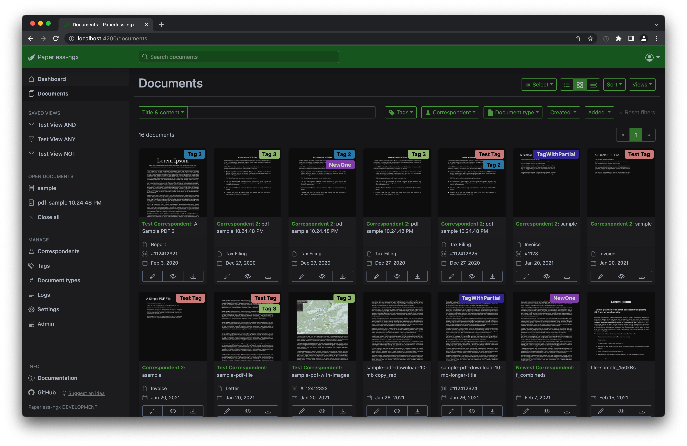

<!--
N.B.: Questo README è stato automaticamente generato da <https://github.com/YunoHost/apps/tree/master/tools/readme_generator>
NON DEVE essere modificato manualmente.
-->

# Paperless-ngx per YunoHost

[](https://dash.yunohost.org/appci/app/paperless-ngx)  

[](https://install-app.yunohost.org/?app=paperless-ngx)

*[Leggi questo README in altre lingue.](./ALL_README.md)*

> *Questo pacchetto ti permette di installare Paperless-ngx su un server YunoHost in modo semplice e veloce.*  
> *Se non hai YunoHost, consulta [la guida](https://yunohost.org/install) per imparare a installarlo.*

## Panoramica

Paperless-ngx is a document management system that transforms your physical documents into a searchable online archive so you can keep, well, *less paper*.

### Features

* Organize and index your scanned documents with tags, correspondents, types, and more.
* Performs OCR on your documents, adds selectable text to image only documents and adds tags, correspondents and document types to your documents.
* Supports PDF documents, images, plain text files, and Office documents (Word, Excel, Powerpoint, and LibreOffice equivalents).
* Paperless stores your documents plain on disk. Filenames and folders are managed by paperless and their format can be configured freely.
* Single page application front end.
* Full text search helps you find what you need.
* Email processing: Paperless adds documents from your email accounts.
* Machine learning powered document matching.
* Optimized for multi core systems: Paperless-ngx consumes multiple documents in parallel.
* The integrated sanity checker makes sure that your document archive is in good health.
* [More screenshots are available in the documentation](https://paperless-ngx.readthedocs.io/en/latest/screenshots.html).


**Versione pubblicata:** 2.6.3~ynh1

**Prova:** <https://demo.paperless-ngx.com/>

## Screenshot



## Documentazione e risorse

- Sito web ufficiale dell’app: <https://paperless-ngx.com>
- Documentazione ufficiale per gli utenti: <https://paperless-ngx.readthedocs.io/en/latest/usage_overview.html>
- Documentazione ufficiale per gli amministratori: <https://paperless-ngx.readthedocs.io/en/latest/index.html>
- Repository upstream del codice dell’app: <https://github.com/paperless-ngx/paperless-ngx>
- Store di YunoHost: <https://apps.yunohost.org/app/paperless-ngx>
- Segnala un problema: <https://github.com/YunoHost-Apps/paperless-ngx_ynh/issues>

## Informazioni per sviluppatori

Si prega di inviare la tua pull request alla [branch di `testing`](https://github.com/YunoHost-Apps/paperless-ngx_ynh/tree/testing).

Per provare la branch di `testing`, si prega di procedere in questo modo:

```bash
sudo yunohost app install https://github.com/YunoHost-Apps/paperless-ngx_ynh/tree/testing --debug
o
sudo yunohost app upgrade paperless-ngx -u https://github.com/YunoHost-Apps/paperless-ngx_ynh/tree/testing --debug
```

**Maggiori informazioni riguardo il pacchetto di quest’app:** <https://yunohost.org/packaging_apps>
